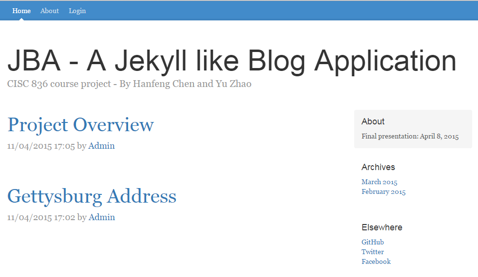
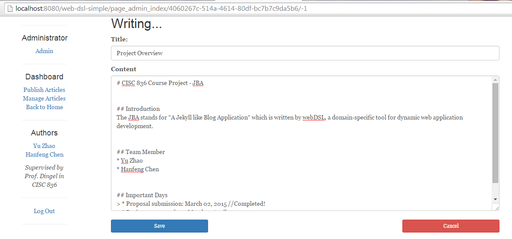
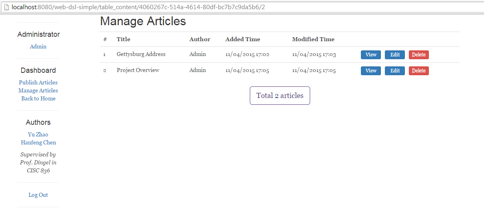
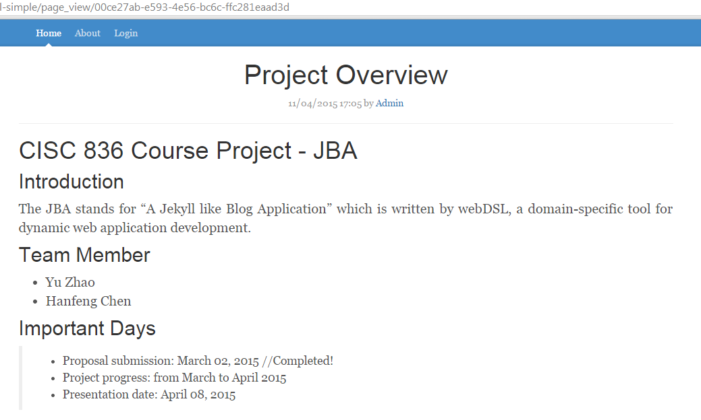
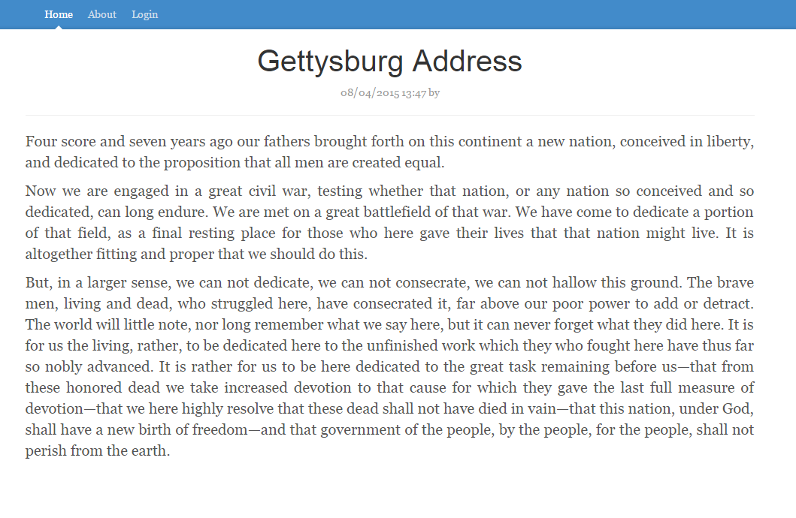

# CISC 836 Course Project - JBA

## Introduction
The JBA stands for "A Jekyll like Blog Application" which is written by webDSL, a domain-specific tool for dynamic web application development.

## Important Days
> * Proposal submission: March 02, 2015
> * Project progress: from March to April 2015
> * Course project presentation: Wednesday, April 8, 2015
> * Final project report is submitted on April 13, 2015

## Updated on April 13, 2015
The final version for course project is updated. Please check out the following instructions to reproduce the JBA. 

Instructions
> Step 1: Install the WebDSL plugin on Eclipse with the following [instruction](http://webdsl.org/selectpage/Download/WebDSLplugin).
> Step 2: Import the whole project into Eclipse environment directly.
> Step 3: Press 'Ctrl+Alt+B' to compile and deploy the JBA

Screenshots






## Updated on March 13, 2015
The website is built on WebDSL with Bootstrap. Thanks for the provider of the Bootstrap template.

To do-list
> * [python-markdown2](https://github.com/trentm/python-markdown2): converts from markdown to HTML, then the HTML is embedded into pages (replaced by `output` function in WebDSL)
> * mysql: connects with WebDSL

A screenshot is available as follows.


## Who are we?
We are current graduate students enroll in CISC 836 course at [Queen's University](http://www.cs.queensu.ca/).

## Any comment?
Please send us email to ```wukefe@gmail.com```. We appreciate any feedback from you.