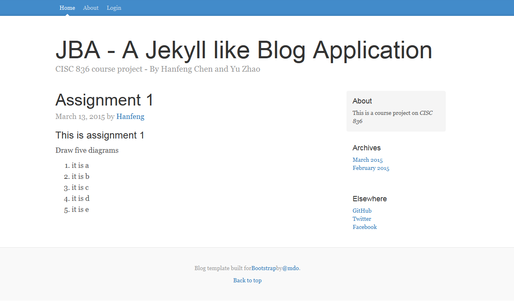

# CISC 836 Course Project - JBA

## Introduction
The JBA stands for "A Jekyll like Blog Application" which is written by webDSL, a domain-specific tool for dynamic web application development.

## Important Days
> * Proposal submission: March 02, 2015 //Completed!
> * Project progress: from March to April 2015
> * The last day of Spring semester: April 30, 2015

## Updated on March 13, 2015
The website is built on WebDSL with Bootstrap. Thanks for the provider of the Bootstrap template.

To do-list
> [python-markdown2](https://github.com/trentm/python-markdown2): converts from markdown to HTML, then the HTML is embedded into pages
> mysql: connects with WebDSL

A screenshot is available as follows.



## Who are we?
We are current graduate students enroll in CISC 836 course at [Queen's University](http://www.cs.queensu.ca/).

## Any comment?
Please send us email to ```wukefe@gmail.com```. We appreciate any feedback from you.